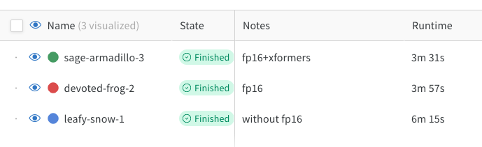

# Кабина спячки

Это разбор статьи [DreamBooth: Fine Tuning Text-to-Image Diffusion Models for Subject-Driven Generation](https://arxiv.org/abs/2208.12242) и тестирование их метода.

[Скрипт для обучения модели](https://colab.research.google.com/github/axchizhov/kabina_spyachky/blob/main/train.ipynb) в коллабе.

[Логи экспериментов](https://wandb.ai/axchizhov/dreambooth-lora/table) в Wandb.

ИЛЛЮСТАРЦИЯ: сгенерированная фотка с матильдой

## Проблема

Навык рисования приобретается за 5-10 лет упорной работы. Это долго и сложно, поэтому большинство из нас рисовать не умеет.

В 1970х годах людям пришла в голову мысль — надо научить рисовать машину. Сначала результаты были весьма убогими, но прогресс не остановить. Десять лет назад появились первые серьезные успехи — искусственная нейросеть генерировала, хотя и с огрехами, правдоподобные фотографии и рисунки. А пару лет назад на свет появился подход, который позволяет создавать практически любые изображения по словесному описанию (text2image generation).

Трудной задачей пока остается генерация конкретных объектов. Машина легко нарисует человека в любой точке планеты и космоса, но вот просто нарисовать заданного человека или предмет ей пока сложно.

Авторы Dreambooth решают эту задачу (few-shot image generation). Например, по небольшому набору изображений собаки (5-10 фото), они учатся генерировать эту собаку в новых ракурсах и положениях:

## Метод решения

Задача решается файнтюнингом любой генеративной text2image модели. 

Метод основан на двух новых идеях:

1. Использование редкого токена в качестве метки субъекта
2. Функция потерь, которая предотвращает переобучение категории субъекта

Схема метода:

Использование этих идей позволяет генерировать субъект в новых контекстах с хорошей точность. Кроме этого, существенно снизились требования к количеству экземпляров субъекта для обучения: со 100 до 3-5 штук.

## Эксперименты

- [ ] Разложить по чекбоксам

1. Оптимизации из коробки, чтобы быстрее итерироваться
fp16 - в два раза быстрее, визуально нет отличий
memory efficient attention (xformers)

2. увеличим количество эпох
100
300
600
900
1200
2400
делить на 4 для получения эпох

рекомендованные 300 эпох
недоообучение до
переобучени после

КАРТИНКИ

3. подключить class preservation loss

для предотвращения overfitting

слишком долго считается -- как-нибудь в другой раз, отключаем пока

поможет с бонусной частью

Prior-preservation is used to avoid overfitting and language-drift

4. 

8bit adam -- no luck

5. stable diffusion 2-1

3.  подключить текст энкодер

4. prompt

a gun -- сложно

- попробовать другой токен
- попробовать более простой аксессуар (вместо глока)

- опробовать разные наборы датасеетов

## Установка

install imagemagic
for i in *.png; do magick convert "$i" -auto-orient -thumbnail 512x512^ -gravity center -extent 512x512 "./crops/$i"; done

for i in *.png; do magick convert "$i" -auto-orient -thumbnail 768x768^ -gravity center -extent 768x768 "$i"; done
