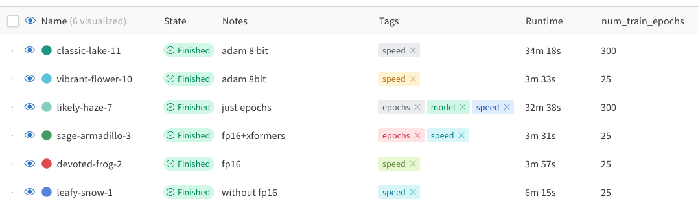

# Кабина спячки

  

Это разбор статьи [DreamBooth: Fine Tuning Text-to-Image Diffusion Models for Subject-Driven Generation](https://arxiv.org/abs/2208.12242) и тестирование их метода.

[Скрипт обучения модели](https://colab.research.google.com/drive/1Cs1gWm7Hn5rVGCknAO7o72GuuE7g3vBF) в колабе.

[Логи экспериментов](https://wandb.ai/axchizhov/dreambooth-lora/table) в Wandb.

## Проблема

Навык рисования приобретается за 5-10 лет упорной работы. Это долго и сложно, поэтому большинство из нас рисовать не умеет.

В 1970х годах людям пришла в голову мысль — надо научить рисовать машину. Сначала результаты были весьма убогими, но прогресс не остановить. Десять лет назад появились первые серьезные успехи — искусственная нейросеть генерировала, хотя и с огрехами, правдоподобные фотографии и рисунки. А пару лет назад на свет появился подход, который позволяет создавать практически любые изображения по словесному описанию (text2image generation).

Трудной задачей пока остается генерация конкретных объектов (few-shot image generation). Машина легко нарисует человека в любой точке планеты и космоса, но вот просто нарисовать заданного человека или предмет ей пока сложно. 

Авторы Dreambooth решают эту задачу. Например, по небольшому набору изображений собаки (5-10 фото), они учатся генерировать эту собаку в новых ракурсах и положениях:

## Метод решения

Задача решается файнтюнингом любой генеративной text2image модели. 

Метод основан на двух новых идеях:

1. Использование редкого токена в качестве метки субъекта
2. Функция потерь, которая предотвращает переобучение категории субъекта

Схема метода:

Использование этих идей позволяет генерировать субъект в новых контекстах с хорошей точностью. Кроме этого, существенно снизились требования к количеству экземпляров субъекта для обучения: со 100 до 3-5 штук.

## Эксперименты

Для обучения взял кадры с Матильдой из фильма Léon: The Professional.

Для тестов подготовил несколько наборов снимков. В качестве основного использовал этот:

Для обучения взял фразу "a photo of sks girl", а для валидации использовал "a photo of sks girl with a glock".

### Результаты

1. **Метод действительно адаптирует модель под субъект, даже без class-preservation loss**

Генерация на разных эпохах обучения:

Модель подхватывает стиль одежды, прическу, черты лица. Также  и дорисовывает новый предмет.

Новый предмет субъекту тоже дорисовывает. Но тут видно, что есть сложности с генерацией вариативных объектов. Нормальное оружие в руках у меня с ходу не получилось сгенерировать. Конкретизация запроса не помогла: "a gun" и "a glock" дают одинаково непохожие на оружие объекты. Впрочем, эта проблема присуща и всем остальным генеративным моделям.

Еще заметно, что без class-preservation loss после 300 эпох модель начинает заметно переобучаться — просто запоминает изображения и воспроизводит их с искажениями:

2. **Совсем быстро обучить робастную модель не получится**

Рекомендованные 300 эпох на 4 изображениях пробегаются быстро, но для работы class-preservation loss требуется проходиться по еще 200-300 изображений, что сильно замедляет обучение. No free lunch :(

3. **Менять генеративную модель можно, но могут быть спецэффекты**

Поменял stable-diffusion-1-5 на stable-diffusion-2-1. Руки стали рисоваться лучше, но, в целом, модель отработала хуже: сильнее переобучалась и на поздних эпохах начала рисовать в стиле пластилиновых игрушек:

4. **Ускорители обучения дают неплохой эффект из коробки**

У меня был ограничен бюджет обучения — Google Colab позволяет пользоваться их GPU ~5-6 часов в сутки (по субъективным ощущениям). Чтобы в него уложиться, быстренько опробовал вычислительные оптимизации, которые доступны из коробки.

Снижение точности вычислений (fp16) вместе с оптимизированным механизмом внимания (xformers) дало почти двухкратный прирост в скорости обучения, и это только на малом количестве эпох. А вот подключение 8-битного Адама эффекта не дало.

### Итоги

Метод действительно позволяет генерировать изображения с конкретным объектом. Модель успешно подхватывает стиль и мелкие детали субъекта и переносит их в новый контекст. Метод рабочий и безусловно перспективен для дальнейшего изучения и развития.

На перспективу интересно было бы еще покопать следующие моменты:

- [ ] Поперебирать различные текстовые описания
- [ ] Попробовать разные гиперпараметры для class-preservation loss
- [ ] Потестировать различные токены
- [ ] Обучить модель на разных наборах изображений
- [ ] Переобучить и попробовать разные энкодеры текста
- [ ] Разобраться в причинах деградации качества в stable diffusivon v2.1

А сейчас пока что все.
